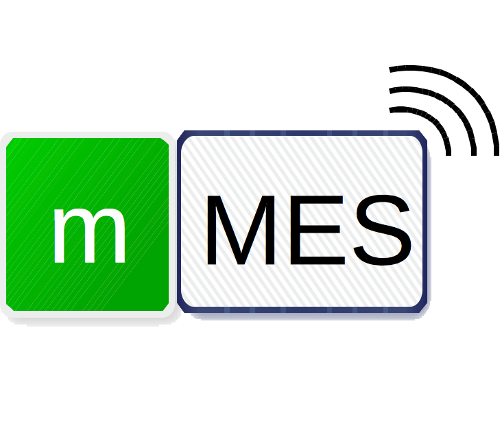
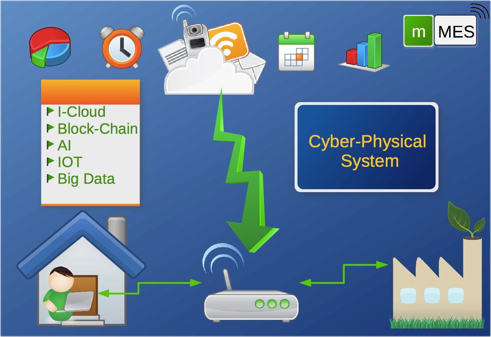

## This is the Home Page of mini MES@Cloud Company.
### mini MES@Cloud is a plateform for Manufacture Manufacture Execution System on remote computer (Cloud).

* We help you monitor and control your manufacture at **any place** on **any time**.
* The Data of every process will store on cloud.
* Data analysis and report can come out from cloud.
* You can install a cheap storage at local site to prevent intrenet break, but all data weill be sync after the internet connet again.
* We will provide adapter or data collect hardware for you to connet your equipments to our cloud on time.

## This is a futur manufacture control system, your choice will help you more efficency and more flexibility.

### The Plateform has use those technology as below:
* Cloud computing and storage
* Blackchain to proof of data
* IOT(Internet of Things) to clollect data
* AI(Airtifical Intelligence) to help you make decision and predict build plan.

### We provide humanized managment, respect to everyone and accept any suggestion.

* This is a new comapny and luanch at 2018/7/16, we are welcom any one who has passion to join us to create the magical plateform.
* You can mail to me <karolin@livemail.tw> for any question.