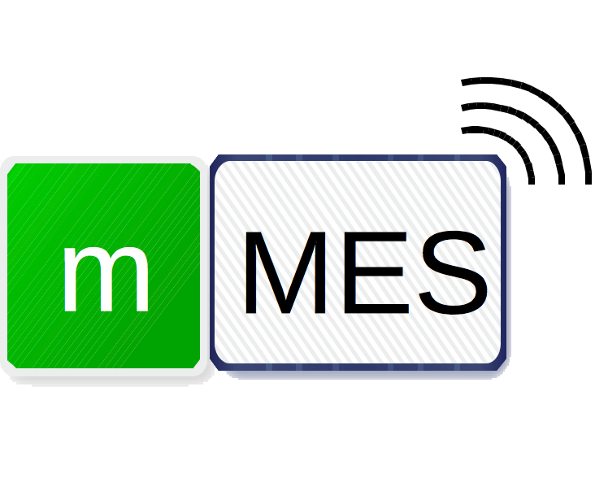
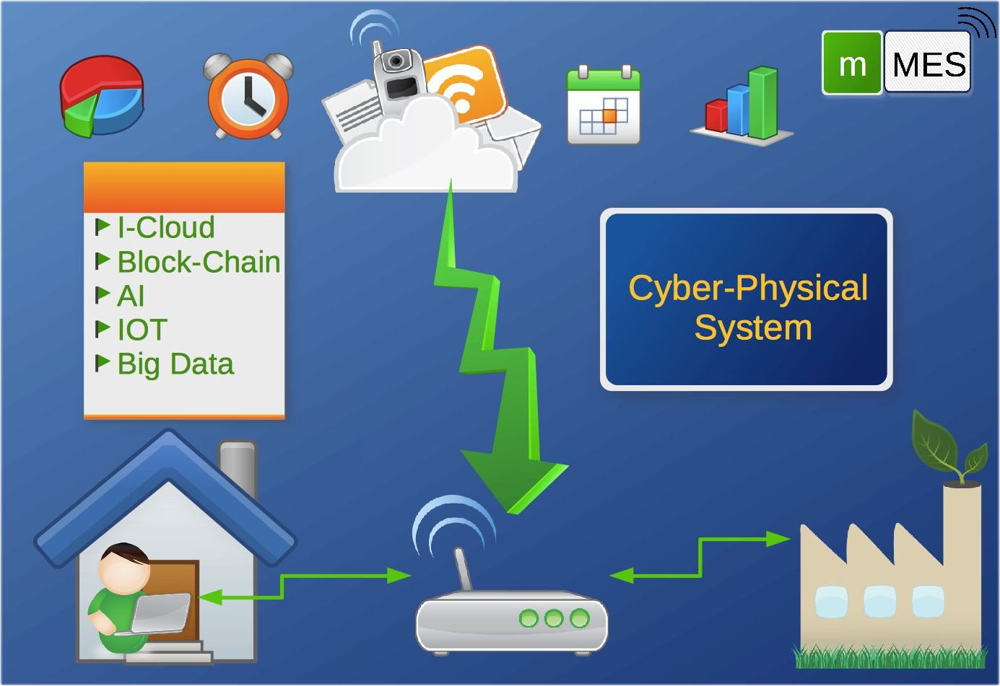
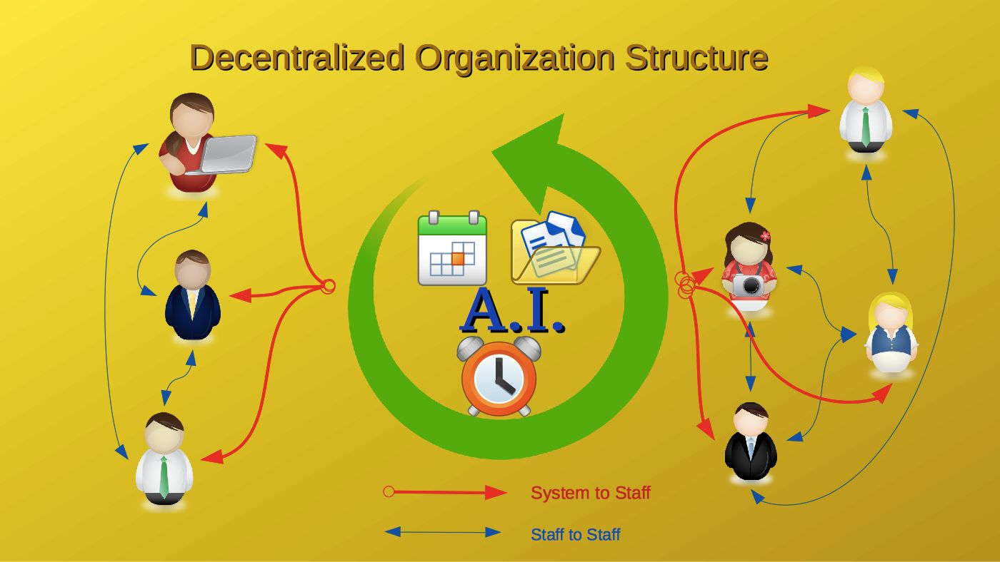

## This is the Home Page of mini MES@Cloud Company.
## 這是一個微型的雲端工廠管理系統，開發基礎於半導體工業需求。

### mini MES@Cloud is a platform for Manufacture Execution System on remote computer (Cloud).
### 微型雲端工廠管理系統平台是屬於大眾的雲端管理系統，該系統建立在雲端以便於使用者在世界任何一個角落都能使用。
* We help you monitor and control your manufacture at **any place** on **any time**.
* The Data of every process will store on cloud.
* Data analysis and report can come out from cloud.
* You can install a cheap storage at local site to prevent internet break, but all data will be sync after the internet connect again.
* We will provide adapter or data collect hardware for you to connect your equipments to our cloud on time.

## This is a future manufacture control system, your choice will help you more efficiency and more flexibility.

### The Platform has use those technology as below:
* Cloud computing and storage
* Blockchain to proof of data
* IOT(Internet of Things) to collect data
* AI(Artificial Intelligence) to help you make decision and predict build plan.

### We provide humanized management, respect to everyone and accept any suggestion.

* This is a new company and launch at 2018/7/16, we are welcome any one who has passion to join us to create the magical platform.
* We designed the real decentralized organization for each one, you can go into the future team work environment.

* You can mail to me <karolin@livemail.tw> for any question.
